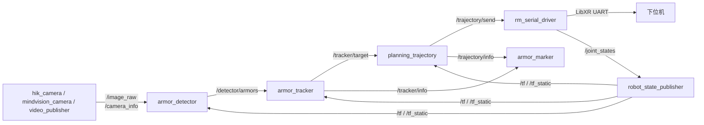

# RM Vision Dev
----
> 基于 ROS2 Humble 的 RoboMaster 视觉自瞄工程文档

## 项目简介

`vision_dev` 是一套上位机视觉自瞄系统。它把图像采集、装甲板识别、目标跟踪、弹道解算、串口通信、云台 TF 建模、仿真和标定工具放在同一个 ROS2 工作空间中，用于快速适配不同机器人分支。

系统的核心链路是：

1. 工业相机或视频回放发布 `/image_raw` 与 `/camera_info`
2. `armor_detector` 识别装甲板并通过 PnP 输出 `/detector/armors`
3. `armor_tracker` 把观测转换到惯性系，估计目标状态并发布 `/tracker/target`
4. `planning_trajectory` 根据目标状态和云台姿态计算瞄准角，发布 `/trajectory/send`
5. `rm_serial_driver` 把云台目标角、开火指令和目标编号发送到下位机，同时发布 `/joint_states`

## 核心功能

- **相机采集** - 支持海康 USB3.0 工业相机、MindVision 工业相机和离线视频回放
- **装甲板识别** - 支持传统灯条识别 + MLP 数字分类，也支持 YOLO OpenVINO/TensorRT 路径
- **目标跟踪** - 使用多模型 EKF 跟踪整车中心、单装甲板和前哨站
- **弹道解算** - 支持解析计算和查表计算，独立实时线程可输出高频控制指令
- **下位机通信** - 通过 LibXR Topic over UART 桥接上下位机
- **云台模型** - 通过 URDF/Xacro、`robot_state_publisher` 和 `/joint_states` 维护 TF
- **仿真与回放** - 支持无相机纯仿真、真云台 + 仿真目标、视频回放识别
- **标定工具** - 提供相机标定、时间戳调试和手眼标定流程

## 系统架构

## 技术栈

| 组件 | 技术 | 用途 |
| ---- | ---- | ---- |
| 中间件 | ROS2 Humble | 组件、话题、TF、launch |
| 编程语言 | C++17 / C++20 | 节点、算法、通信 |
| 图像处理 | OpenCV / cv_bridge / image_transport | 图像采集、识别、PnP、标定 |
| 目标识别 | OpenCV DNN / OpenVINO / TensorRT | MLP 数字分类和 YOLO 推理 |
| 状态估计 | Eigen + EKF | 目标跟踪、弹道平滑 |
| 坐标变换 | tf2 / robot_state_publisher / xacro | 云台、相机、惯性系维护 |
| 通信 | LibXR + LinuxUART | 上位机与电控下位机通信 |
| 构建 | ament_cmake / ament_cmake_auto / colcon | ROS2 包构建 |

## 功能包一览

| 包名 | 功能 | 主要节点 |
| ---- | ---- | ---- |
| [auto_aim_interfaces](packages/auto-aim-interfaces.md) | 自定义消息定义 | 无 |
| [armor_detector](packages/armor-detector.md) | 装甲板检测、分类、PnP | `armor_detector` |
| [armor_tracker](packages/armor-tracker.md) | 目标跟踪、状态估计 | `armor_tracker` |
| [planning_trajectory](packages/planning-trajectory.md) | 弹道解算、控制量输出 | `planning_trajectory` |
| [armor_marker](packages/armor-marker.md) | RViz/Foxglove 可视化 | `armor_marker` |
| [hik_camera](packages/hik-camera.md) | 海康相机驱动 | `camera_node` |
| [mindvision_camera](packages/mindvision-camera.md) | MindVision 相机驱动 | `camera_node` |
| [rm_serial_driver](packages/rm-serial-driver.md) | LibXR 串口桥接 | `serial_driver` |
| [rm_simulator](packages/rm-simulator.md) | 装甲板目标仿真 | `rm_simulator` |
| [rm_gimbal_description](packages/rm-gimbal-description.md) | 云台 URDF/Xacro | 无 |
| [rm_hand_eye_calibrate](packages/rm-hand-eye-calibrate.md) | 手眼标定 | `hand_eye_calibrate_node` |
| [video_publisher](packages/video-publisher.md) | 离线视频发布 | `video_publisher` |
| [rm_vision_bringup](packages/rm-vision-bringup.md) | launch 编排 | 无 |
| [libxr](packages/libxr.md) | 通信基础库 ROS2 wrapper | 无 |

## 快速导航

- [环境依赖与编译](guide/prerequisites.md)
- [系统架构](architecture/README.md)
- [节点通信图](architecture/node-graph.md)
- [话题列表](interfaces/topics.md)
- [功能包详解](packages/README.md)
- [实车运行流程](workflow/live-run.md)
