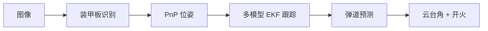

# 算法概览

主算法链路按“观测、估计、预测、输出”拆分：

## 算法模块

| 模块 | 输入 | 输出 | 说明 |
| ---- | ---- | ---- | ---- |
| 装甲板识别 | 图像、内参 | 装甲板位姿 | 传统灯条或 YOLO |
| 目标跟踪 | 装甲板观测、TF | 目标状态 | 多模型 EKF + 状态机 |
| 弹道解算 | 目标状态、云台角 | pitch/yaw/开火 | 查表或解析计算 |
| 手眼标定 | 图像、内参、IMU 姿态 | 相机外参 | OpenCV hand-eye |
| 仿真模型 | 参数化目标运动 | 装甲板观测 | 供 tracker 和弹道调试 |

## 调参优先级

1. 相机内参与曝光先正确，否则 PnP 结果不可信。
2. URDF 外参与 TF 方向先正确，否则 tracker 坐标会漂。
3. 识别阈值先保证稳定输出，再调 EKF。
4. 跟踪稳定后再调弹道偏置和开火条件。

