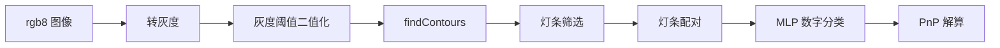

# 装甲板识别算法

## 传统识别流程

### 灯条筛选

灯条由轮廓的最小外接矩形生成，主要筛选条件：

- 长宽比在 `light.min_ratio` 与 `light.max_ratio` 之间
- 倾斜角小于 `light.max_angle`
- ROI 内红蓝通道求和判断颜色

### 灯条配对

两条灯条配成装甲板时会检查：

- 颜色是否为目标颜色
- 两灯条长度比例是否合理
- 中心距离是否落在小装甲板或大装甲板范围
- 配对后的装甲板倾角是否过大

### 数字分类

传统后端使用 `model/mlp.onnx` 和 `model/label.txt`：

1. 根据灯条角点做透视变换
2. 截取数字 ROI
3. 二值化
4. 输入 MLP 分类
5. 低置信度或忽略类别会被过滤

## YOLO 后端

`detector_type=yolo` 时使用 YOLO11 模型。相关参数：

| 参数 | 默认值 | 说明 |
| ---- | ------ | ---- |
| `yolo.model_path` | `""` | 模型路径，空值时走包内默认 |
| `yolo.device` | `CPU` | OpenVINO 设备 |
| `yolo.input_size` | `640` | 输入尺寸 |
| `yolo.score_threshold` | `0.7` | 分数阈值 |
| `yolo.min_confidence` | `0.8` | 最低置信度 |
| `yolo.nms_threshold` | `0.3` | NMS 阈值 |
| `yolo.num_keypoints` | `4` | 关键点数量 |
| `yolo.large_armor_ratio_threshold` | `3.2` | 大装甲板宽高比阈值 |
| `yolo.end_to_end` | `false` | 是否使用端到端输出 |

## PnP 解算

识别得到装甲板四个角点后，`PnPSolver` 使用相机内参求解装甲板在相机坐标系中的 `pose`。

如果启用 `optimizer.use_pose_optimizer`，节点会查询 TF，并根据云台姿态和装甲板安装角对 PnP 结果做优化。

