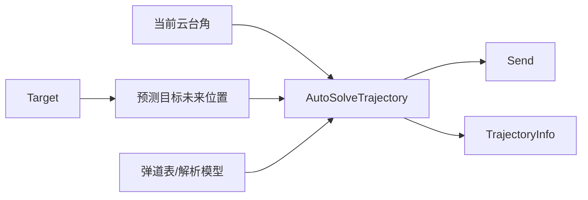

# 弹道解算算法

## 目标

`planning_trajectory` 的目标是把 tracker 输出的目标状态转换成云台可执行的：

- `pitch`
- `yaw`
- `is_fire`
- `num`

## 输入量

| 输入 | 来源 | 说明 |
| ---- | ---- | ---- |
| 目标中心/装甲板位置 | `/tracker/target` | 世界系目标状态 |
| 目标速度与角速度 | `/tracker/target` | 用于预测未来位置 |
| 云台 yaw/pitch | TF | 当前云台姿态 |
| 弹速 | `/current_velocity` | 可选输入 |
| 弹道表 | `rm_vision_bringup/config` | 查表模式 |

## 解算流程

## 查表模式

`calculate_mode=true` 时，弹道节点读取 `table.filename`。英雄机器人还可读取 `table.filename_lob`。

查表参数：

| 参数 | 说明 |
| ---- | ---- |
| `table.min_x/max_x` | 普通弹道表水平距离范围 |
| `table.min_y/max_y` | 普通弹道表高度范围 |
| `table.resolution` | 普通弹道表分辨率 |
| `table.min_x_lob/max_x_lob` | 吊射弹道表距离范围 |
| `table.min_y_lob/max_y_lob` | 吊射弹道表高度范围 |
| `table.resolution_lob` | 吊射弹道表分辨率 |

## 实时线程

独立实时线程会尽量：

- 绑定到指定 CPU
- 设置 `SCHED_FIFO`
- 锁定内存
- 用绝对时间睡眠减少周期漂移

如果系统权限不足，会记录 warning 并降级运行。

