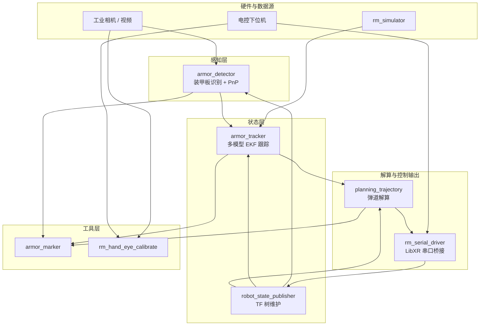

# 架构总览

## 分层视角

## 关键设计点

- 主链路节点都以 component 形式注册，`rm_vision_bringup` 可把多个节点装进同一个 `component_container_mt`。
- `planning_trajectory` 独立容器运行，便于配置独立线程数、CPU 亲和性和实时线程。
- 识别输出位于相机光学坐标系，跟踪节点通过 TF 转换到 `target_frame`，默认是 `odom`。
- 串口节点是 ROS2 与 LibXR Topic 的边界，ROS2 侧使用 `/trajectory/send`，下位机侧使用 `target_euler`、`fire_notify`、`target_num` 等 LibXR 话题。
- `rm_simulator` 可以替代识别节点直接发布 `/detector/armors`，用于无相机调试。

## 主要数据闭环

| 阶段 | 输入 | 输出 | 说明 |
| ---- | ---- | ---- | ---- |
| 采集 | 相机 SDK / 视频文件 | `/image_raw`, `/camera_info` | 图像和内参 |
| 识别 | 图像、内参、可选 TF | `/detector/armors` | 装甲板类别和相机系位姿 |
| 跟踪 | `/detector/armors`, TF | `/tracker/target` | 目标中心、速度、yaw、半径 |
| 解算 | `/tracker/target`, TF | `/trajectory/send` | pitch/yaw/开火/目标编号 |
| 通信 | `/trajectory/send` | LibXR UART | 控制下发，下位机回传云台姿态 |
| TF | `/joint_states`, URDF | `/tf`, `/tf_static` | 提供云台与相机坐标关系 |

