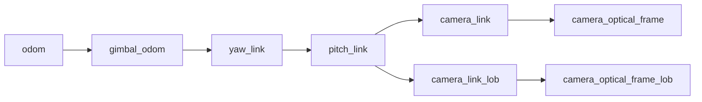

# 坐标系与 TF

## 核心坐标系

| 坐标系 | 来源 | 说明 |
| ------ | ---- | ---- |
| `odom` | URDF / 仿真 | 世界惯性系或比赛场地参考系 |
| `gimbal_odom` | URDF / 仿真 | 云台上电时 yaw 参考惯性系 |
| `yaw_link` | `robot_state_publisher` | yaw 轴转动后的坐标系 |
| `pitch_link` | `robot_state_publisher` | pitch 轴转动后的坐标系 |
| `camera_link` | URDF | 相机机械安装坐标系 |
| `camera_optical_frame` | URDF | ROS optical frame，通常 z 轴向前 |
| `camera_optical_frame_lob` | URDF / 相机节点 | 英雄吊射相机 optical frame |

## TF 链路

## 方向约定

项目遵循 ROS REP-103：

- 线性单位使用米
- 角度在代码中使用弧度
- 相机图像消息使用 optical frame
- PnP 输出的装甲板位姿先位于相机光学坐标系，再由 tracker 转换到目标惯性系

## URDF 参数

`rm_gimbal_description/urdf/rm_gimbal.urdf.xacro` 通过参数描述相机安装：

| 参数 | 说明 |
| ---- | ---- |
| `xyz` | 普通相机相对 `pitch_link` 的平移 |
| `rpy` | 普通相机相对 `pitch_link` 的旋转 |
| `lob_xyz` | 吊射相机平移 |
| `lob_rpy` | 吊射相机旋转 |

这些参数通常来自机械测量或 `rm_hand_eye_calibrate` 求解。

## 节点对 TF 的依赖

| 节点 | 需要的 TF | 用途 |
| ---- | --------- | ---- |
| `armor_detector` | `gimbal_odom -> camera_optical_frame`, `gimbal_odom -> pitch_link` | 可选位姿优化 |
| `armor_tracker` | `target_frame -> camera_optical_frame` | 将识别观测转到惯性系 |
| `planning_trajectory` | `gimbal_odom -> yaw_link`, `gimbal_odom -> pitch_link` | 获取当前云台角 |
| `armor_marker` | marker header frame | 可视化检测和跟踪结果 |

