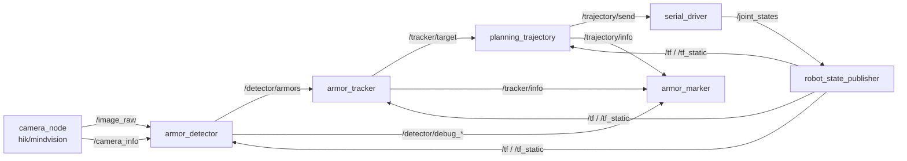
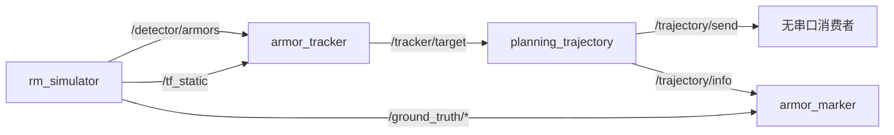
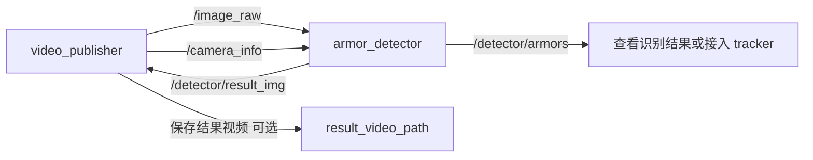

# 节点通信图

## 实车主链路

## 纯仿真链路

## 视频回放链路

## 主要话题速查

| 话题 | 发布者 | 订阅者 | 说明 |
| ---- | ------ | ------ | ---- |
| `/image_raw` | 相机 / 视频 | `armor_detector`, `rm_hand_eye_calibrate` | RGB 图像 |
| `/camera_info` | 相机 / 视频 | `armor_detector`, `rm_hand_eye_calibrate` | 相机内参 |
| `/detector/armors` | `armor_detector` / `rm_simulator` | `armor_tracker`, `armor_marker` | 装甲板观测 |
| `/tracker/target` | `armor_tracker` | `planning_trajectory`, `armor_marker` | 跟踪目标 |
| `/trajectory/send` | `planning_trajectory` | `rm_serial_driver` | 云台目标角和开火 |
| `/joint_states` | `rm_serial_driver` | `robot_state_publisher` | 云台 yaw/pitch |
| `/tf`, `/tf_static` | `robot_state_publisher` / `rm_simulator` | 识别、跟踪、弹道 | 坐标变换 |
