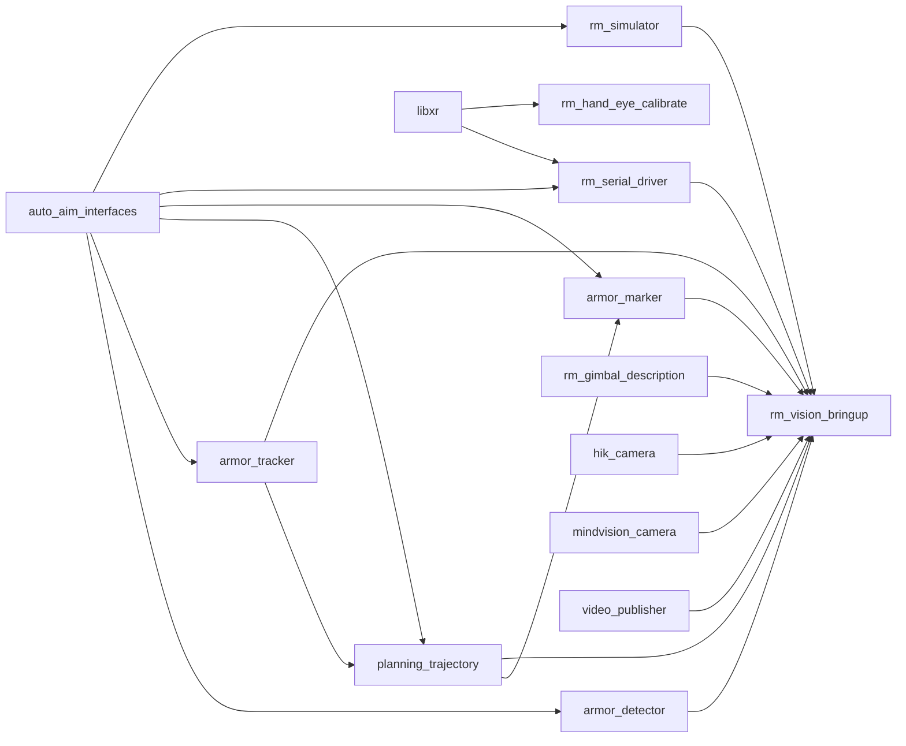

# 功能包全景

系统包含 14 个 ROS2 功能包，分为接口、感知、状态估计、控制输出、硬件驱动、工具和启动编排几类。

## 功能包列表

| 包名 | 类型 | 语言 | 核心职责 |
| ---- | ---- | ---- | -------- |
| `auto_aim_interfaces` | 接口定义 | `.msg` | 定义识别、跟踪、弹道和调试消息 |
| `armor_detector` | 感知算法 | C++20 | 装甲板检测、数字分类、PnP 位姿解算 |
| `armor_tracker` | 状态估计 | C++20 | 多模型 EKF 跟踪、目标切换、前哨站处理 |
| `planning_trajectory` | 弹道控制 | C++20 | 弹道解算、查表、瞄准角与开火决策 |
| `armor_marker` | 可视化 | C++20 | 发布检测、跟踪和瞄准点 marker |
| `hik_camera` | 相机驱动 | C++14 | 海康 USB3.0 工业相机采集 |
| `mindvision_camera` | 相机驱动 | C++14 | MindVision 工业相机采集 |
| `rm_serial_driver` | 通信驱动 | C++17 | LibXR UART 桥接，下发控制并发布关节状态 |
| `rm_simulator` | 仿真工具 | C++20 | 生成仿真装甲板和真值数据 |
| `rm_gimbal_description` | 机器人描述 | Xacro | 云台、相机和 optical frame 的 URDF |
| `rm_hand_eye_calibrate` | 标定工具 | C++17 | 标定相机相对云台的安装外参 |
| `video_publisher` | 回放工具 | C++14 | 从视频文件发布图像和内参 |
| `rm_vision_bringup` | 启动编排 | Python launch | 组合实车、仿真、视频回放等运行模式 |
| `libxr` | 基础库 wrapper | C++20 | 将 LibXR 作为 ROS2 可链接库导出 |

## 依赖关系

> `auto_aim_interfaces` 是主链路的基础接口包；`rm_vision_bringup` 不实现算法，而是根据运行模式把其他包组合起来。

## 节点数量

| 包名 | 节点 |
| ---- | ---- |
| `armor_detector` | `armor_detector` |
| `armor_tracker` | `armor_tracker` |
| `planning_trajectory` | `planning_trajectory` |
| `armor_marker` | `armor_marker` |
| `hik_camera` | `camera_node` |
| `mindvision_camera` | `camera_node` |
| `rm_serial_driver` | `serial_driver` |
| `rm_simulator` | `rm_simulator` |
| `rm_hand_eye_calibrate` | `hand_eye_calibrate_node` |
| `video_publisher` | `video_publisher` |

其余包主要提供接口、URDF、launch 或库。
