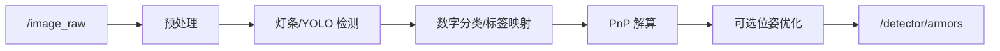

# armor_detector - 装甲板识别包

## 概述

`armor_detector` 订阅图像与相机内参，识别装甲板，完成数字分类和 PnP 解算，发布相机坐标系下的装甲板三维位姿。

**路径**: `src/rm_auto_aim/armor_detector/`

## 包结构

```text
armor_detector/
├── include/armor_detector/
│   ├── detector_node.hpp
│   ├── detector.hpp
│   ├── yolo_detector.hpp
│   ├── pnp_solver.hpp
│   ├── number_classifier.hpp
│   └── armor_pose_optimizer.hpp
├── src/
│   ├── detector_node.cpp
│   ├── detector.cpp
│   ├── yolo_detector.cpp
│   ├── pnp_solver.cpp
│   └── number_classifier.cpp
├── model/
│   ├── mlp.onnx
│   ├── label.txt
│   └── yolo11*.onnx/xml/bin
└── test/
```

## 节点

| 项 | 内容 |
| -- | ---- |
| 节点名 | `armor_detector` |
| 组件插件 | `rm_auto_aim::ArmorDetectorNode` |
| 可执行文件 | `armor_detector_node` |

## 订阅话题

| 话题 | 类型 | 说明 |
| ---- | ---- | ---- |
| `/image_raw` | `sensor_msgs/msg/Image` | RGB 图像 |
| `/camera_info` | `sensor_msgs/msg/CameraInfo` | 相机内参，初始化 PnP |
| `/tf`, `/tf_static` | `tf2_msgs/msg/TFMessage` | 可选位姿优化使用 |

## 发布话题

| 话题 | 类型 | 说明 |
| ---- | ---- | ---- |
| `/detector/armors` | `auto_aim_interfaces/msg/Armors` | 装甲板检测结果 |
| `/detector/debug_lights` | `DebugLights` | debug 开启时发布 |
| `/detector/debug_armors` | `DebugArmors` | debug 开启时发布 |
| `/detector/binary_img` | `sensor_msgs/msg/Image` | 二值化图像 |
| `/detector/number_img` | `sensor_msgs/msg/Image` | 数字 ROI 图像 |
| `/detector/result_img` | `sensor_msgs/msg/Image` | 带绘制结果的图像 |

## 检测后端

| `detector_type` | 说明 |
| --------------- | ---- |
| `traditional` | 灰度二值化、灯条查找、灯条配对、MLP 数字分类 |
| `yolo` | YOLO11 模型推理，支持 OpenVINO 或 TensorRT 构建路径 |

## 主要参数

| 参数 | 默认值 | 说明 |
| ---- | ------ | ---- |
| `detector_type` | `traditional` | 检测后端 |
| `debug` | `false` | 是否发布调试图像和调试数据 |
| `robot_type` | `default` | 英雄机器人会保留相机内参订阅以支持切换 |
| `detect_color` | `RED` | 传统检测目标颜色 |
| `binary_lower_thres` | `160` | 灰度二值化下限 |
| `binary_upper_thres` | `255` | 灰度二值化上限 |
| `classifier_threshold` | `0.7` | MLP 数字分类阈值 |
| `ignore_classes` | `["negative"]` | 忽略类别 |
| `pnp_filter.*` | 见配置页 | PnP 结果过滤权重 |
| `optimizer.*` | 见配置页 | 可选位姿优化参数 |
| `yolo.*` | 见配置页 | YOLO 模型、设备和阈值 |

## 工作流程



## 注意事项

- PnP 必须等待 `/camera_info`，没有内参时会跳过图像。
- debug 图像只有 `debug=true` 时创建发布者。
- 传统检测使用 `rgb8` 输入，灯条颜色通过 ROI 内红蓝通道求和判断。
- YOLO 后端只有在编译时启用 OpenVINO 或 TensorRT 时可用。

