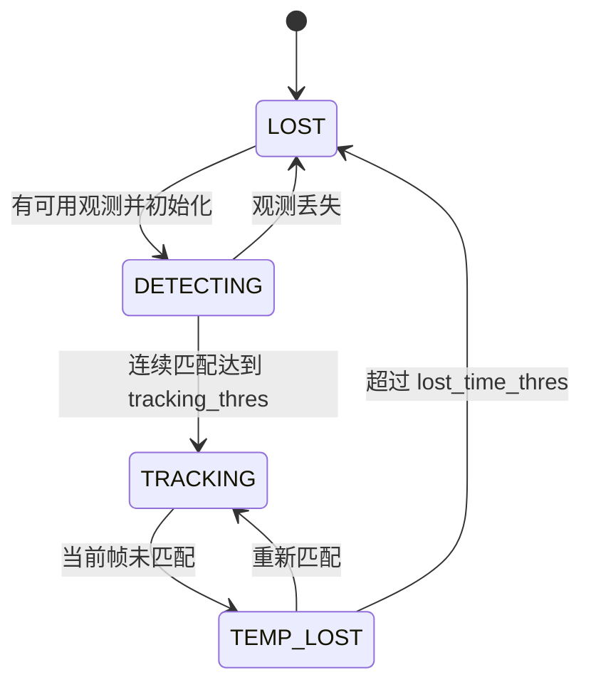

# armor_tracker - 目标跟踪包

## 概述

`armor_tracker` 接收 `/detector/armors`，通过 TF 把装甲板观测转到惯性系，使用多模型 EKF 估计目标中心、速度、yaw、角速度和装甲板半径，输出给弹道节点。

**路径**: `src/rm_auto_aim/armor_tracker/`

## 节点

| 项 | 内容 |
| -- | ---- |
| 节点名 | `armor_tracker` |
| 组件插件 | `rm_auto_aim::ArmorTrackerNode` |
| 可执行文件 | `armor_tracker_node` |

## 订阅话题

| 话题 | 类型 | 说明 |
| ---- | ---- | ---- |
| `/detector/armors` | `auto_aim_interfaces/msg/Armors` | 装甲板观测 |
| `/tf`, `/tf_static` | `tf2_msgs/msg/TFMessage` | 相机到目标惯性系的变换 |

## 发布话题

| 话题 | 类型 | 说明 |
| ---- | ---- | ---- |
| `/tracker/target` | `auto_aim_interfaces/msg/Target` | 目标状态，供弹道节点使用 |
| `/tracker/info` | `auto_aim_interfaces/msg/TrackerInfo` | 调试信息 |

## 状态机

## 跟踪模型

| 模型 | 状态维度 | 使用场景 |
| ---- | -------- | -------- |
| 整车模型 `FULL` | 8 维 | 目标有明显旋转，需要估计中心和半径 |
| 装甲板 CV 模型 `ARMOR` | 5 维 | 目标角速度较小，直接跟踪装甲板 |
| 前哨站模型 `OUTPOST` | 5 维 | 识别到前哨站装甲板 |

普通目标会根据 `v_yaw_armor_threshold` 和 `v_yaw_full_threshold` 在整车模型与装甲板模型之间迟滞切换。

## 主要参数

| 参数 | 默认值 | 说明 |
| ---- | ------ | ---- |
| `target_frame` | `odom` | 目标状态输出坐标系 |
| `max_armor_distance` | `10.0` | 超出该水平距离的装甲板会被过滤 |
| `tracker.max_match_distance` | `0.15` | 位置匹配阈值 |
| `tracker.max_match_yaw_diff` | `1.0` | yaw 匹配阈值 |
| `tracker.tracking_thres` | `5` | 从 DETECTING 进入 TRACKING 的帧数 |
| `tracker.lost_time_thres` | `0.3` | 丢失超时时间 |
| `tracker.change_time_thres` | `0.3` | 目标切换时间阈值 |
| `tracker.radius_min/max` | `0.12 / 0.4` | 装甲板半径约束 |
| `ekf.*` | 见配置页 | 过程噪声与测量噪声 |
| `outpost.*` | 见配置页 | 前哨站模型参数 |

## 输出字段

`/tracker/target` 中最关键字段：

| 字段 | 说明 |
| ---- | ---- |
| `tracking` | 当前是否可跟踪 |
| `position` | 目标中心或装甲板位置 |
| `velocity` | 目标线速度 |
| `yaw`, `v_yaw` | 目标 yaw 与角速度 |
| `radius_1`, `radius_2`, `dz` | 弹道预测装甲板位置所需几何量 |
| `armors_num`, `outpost_idx` | 目标装甲板数量与前哨索引 |
| `num` | 数字目标编号，供下位机或策略使用 |

