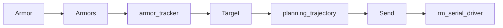

# auto_aim_interfaces - 接口定义包

## 概述

`auto_aim_interfaces` 定义视觉主链路中使用的自定义消息。它没有运行节点，是 `armor_detector`、`armor_tracker`、`planning_trajectory`、`armor_marker`、`rm_serial_driver` 和 `rm_simulator` 的接口基础。

**路径**: `src/rm_auto_aim/auto_aim_interfaces/`

## 消息列表

| 消息 | 用途 |
| ---- | ---- |
| `Armor` | 单块装甲板检测结果 |
| `Armors` | 一帧中的多块装甲板 |
| `Target` | 跟踪器输出的目标状态 |
| `Send` | 弹道节点下发给串口节点的控制命令 |
| `Velocity` | 当前弹速或速度输入 |
| `TrackerInfo` | 跟踪调试信息 |
| `TrajectoryInfo` | 弹道调试信息 |
| `DebugLight` / `DebugLights` | 灯条调试数据 |
| `DebugArmor` / `DebugArmors` | 装甲板调试数据 |

## 核心消息关系

## 维护建议

- 新增字段时优先考虑是否影响下游节点的默认值和兼容性。
- `Target` 是跟踪与弹道之间的核心契约，修改前需要同步 `planning_trajectory`。
- `Send` 是上位机到下位机的核心契约，修改前需要同步下位机 LibXR 话题结构。

