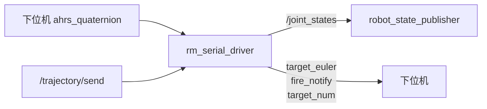

# rm_serial_driver - 串口通信包

## 概述

`rm_serial_driver` 是 ROS2 与下位机之间的通信边界。它使用 LibXR 的 Linux UART 和 Topic 机制，从下位机接收云台姿态与吊射信号，并把弹道节点输出的目标角、开火标志和目标编号发送给下位机。

**路径**: `src/rm_serial_driver/`

## 节点

| 项 | 内容 |
| -- | ---- |
| 节点名 | `serial_driver` 或单独 launch 中的 `rm_serial_driver` |
| 组件插件 | `rm_serial_driver::RMSerialDriver` |
| 可执行文件 | `rm_serial_driver_node` |

## ROS2 订阅

| 话题 | 类型 | 说明 |
| ---- | ---- | ---- |
| `/trajectory/send` | `auto_aim_interfaces/msg/Send` | 弹道节点输出的控制命令 |

## ROS2 发布

| 话题 | 类型 | 说明 |
| ---- | ---- | ---- |
| `/joint_states` | `sensor_msgs/msg/JointState` | 云台 pitch/yaw，供 TF 使用 |
| `/lob_shot_switch` | `std_msgs/msg/Bool` | 英雄机器人吊射触发上升沿 |

## LibXR 话题

| 方向 | 话题 | 说明 |
| ---- | ---- | ---- |
| 下位机到上位机 | `ahrs_quaternion` | 云台姿态四元数 |
| 下位机到上位机 | `lob_shot` | 吊射切换信号 |
| 上位机到下位机 | `target_euler` | 云台目标欧拉角，可带速度和加速度 |
| 上位机到下位机 | `tracker/fire_notify` | 开火通知 |
| 上位机到下位机 | `target_num` | 当前目标编号 |

## 主要参数

| 参数 | 默认值 | 说明 |
| ---- | ------ | ---- |
| `vid` | `16d0` | USB Vendor ID |
| `pid` | `1492` | USB Product ID |
| `timestamp_offset` | `0` | `/joint_states` 时间戳补偿 |
| `robot_type` | `default` | `hero` 时启用吊射信号发布 |
| `send_velocity` | `true` | `target_euler` 是否包含 yaw 速度和加速度 |

## 启动

```bash
ros2 launch rm_serial_driver ros2_libxr_launch.py
```

## 数据转换



## 注意事项

- `/joint_states` 中关节名为 `pitch_joint` 和 `yaw_joint`，需要与 URDF 保持一致。
- `timestamp_offset` 会从当前时间中减去，用于对齐下位机姿态和相机图像。
- `robot_type=hero` 时才发布 `/lob_shot_switch`。
