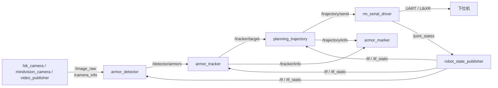

# RM Vision Dev

<div align="center">

  <p>
    <strong>基于 ROS 2 Humble 的 RoboMaster 上位机视觉自瞄系统</strong>
  </p>

  <p>
    将相机采集、装甲板识别、目标跟踪、弹道解算、串口通信、TF 建模、仿真回放和标定工具组织在同一个 ROS 2 工作空间中，用于快速适配不同机器人分支。
  </p>

  <p>
    
    
    
    
  </p>

  <p>
    <a href="#快速开始">快速开始</a>
    ·
    <a href="#运行">运行</a>
    ·
    <a href="#调试与标定">调试与标定</a>
    ·
    <a href="docs/README.md">完整文档</a>
  </p>

</div>


## 目录

- [RM Vision Dev](#rm-vision-dev)
  - [目录](#目录)
  - [特性](#特性)
  - [系统架构](#系统架构)
  - [功能包](#功能包)
  - [环境要求](#环境要求)
  - [快速开始](#快速开始)
    - [1. 获取源码](#1-获取源码)
    - [2. 安装依赖](#2-安装依赖)
    - [3. 编译](#3-编译)
    - [4. 获取测试资源](#4-获取测试资源)
  - [运行](#运行)
    - [实车启动](#实车启动)
    - [无硬件启动](#无硬件启动)
    - [单独启动相机](#单独启动相机)
    - [单独启动串口](#单独启动串口)
    - [启动可视化](#启动可视化)
  - [调试与标定](#调试与标定)
    - [相机标定](#相机标定)
    - [机器人坐标系](#机器人坐标系)
    - [时间戳对齐](#时间戳对齐)
    - [卡尔曼滤波参数](#卡尔曼滤波参数)
    - [手眼标定](#手眼标定)
  - [模型转换](#模型转换)
  - [开发流程](#开发流程)
  - [文档](#文档)
  - [License](#license)

## 特性

- **多相机输入**：支持海康工业相机、MindVision 工业相机和离线视频回放。
- **装甲板识别**：支持传统灯条识别、数字分类和 YOLO 推理路径。
- **目标跟踪**：基于 EKF 的整车中心、单装甲板和前哨站目标状态估计。
- **弹道解算**：支持解析弹道和查表弹道，并输出云台控制目标。
- **上下位机通信**：基于 LibXR 的 UART 通信桥接，发送控制量并接收云台状态。
- **TF 建模**：通过 URDF/Xacro、`robot_state_publisher` 和 `/joint_states` 维护相机、云台与惯性系关系。
- **仿真与回放**：支持无硬件仿真、真云台 + 仿真目标、离线视频回放。
- **标定工具**：提供相机标定、时间戳对齐、手眼标定和实车调试流程。

## 系统架构



## 功能包

| 包名 | 作用 |
| --- | --- |
| `auto_aim_interfaces` | 自定义消息定义 |
| `armor_detector` | 装甲板检测、分类和 PnP 位姿解算 |
| `armor_tracker` | 目标跟踪、状态估计和目标切换 |
| `planning_trajectory` | 弹道解算、瞄准角和开火决策 |
| `armor_marker` | RViz / Foxglove 可视化标记 |
| `hik_camera` | 海康工业相机驱动 |
| `mindvision_camera` | MindVision 工业相机驱动 |
| `video_publisher` | 离线视频图像发布 |
| `rm_serial_driver` | 上下位机串口通信 |
| `rm_gimbal_description` | 云台、相机和光轴坐标系描述 |
| `rm_simulator` | 装甲板目标仿真 |
| `rm_hand_eye_calibrate` | 手眼标定工具 |
| `rm_vision_bringup` | 实车、仿真和回放 launch 编排 |
| `libxr` | LibXR ROS 2 wrapper |

## 环境要求

- Ubuntu 22.04
- ROS 2 Humble
- `colcon`
- `rosdep`
- `git-lfs`，仅在需要下载测试资源时使用
- 海康或 MindVision 相机 SDK，按对应相机包要求配置
- 可选：Foxglove Bridge，用于可视化调试

安装常用依赖：

```bash
sudo apt update
sudo apt install git git-lfs python3-colcon-common-extensions python3-rosdep
sudo apt install ros-humble-foxglove-bridge
```

如果是第一次使用 `rosdep`：

```bash
sudo rosdep init
rosdep update
```

## 快速开始

### 1. 获取源码

```bash
mkdir -p ~/AUTO_AIM
cd ~/AUTO_AIM
git clone https://github.com/QDU-VRobot/vision_dev.git --recursive
cd vision_dev
```

如果 clone 时没有带 `--recursive`，需要手动拉取子模块：

```bash
git submodule update --init --recursive
```

第一次 clone 本仓库后建议启用项目 Git hooks：

```bash
git config core.hooksPath .githooks
```

### 2. 安装依赖

```bash
rosdep install --from-paths src --ignore-src -r -y
```

### 3. 编译

```bash
colcon build --symlink-install
source install/setup.bash
```

### 4. 获取测试资源

测试资源使用 Git LFS 管理，只有在需要视频、模型或回放数据时再下载。

```bash
git lfs install
git clone git@github.com:QDU-VRobot/test_assets.git src/rm_vision/rm_vision_bringup/test_assets
cd src/rm_vision/rm_vision_bringup/test_assets
git lfs pull
```

## 运行

每个新终端都需要先进入工作空间并 source：

```bash
cd ~/AUTO_AIM/vision_dev
source install/setup.bash
```

### 实车启动

```bash
sudo chmod 777 /dev/ttyACM0
ros2 launch rm_vision_bringup vision_bringup.launch.py robot:=<robot_type>
```

### 无硬件启动

```bash
ros2 launch rm_vision_bringup no_hardware.launch.py
```

### 单独启动相机

海康相机：

```bash
ros2 launch hik_camera hik_camera.launch.py
```

MindVision 相机：

```bash
ros2 launch mindvision_camera mindvision_camera.launch.py
```

### 单独启动串口

```bash
ros2 launch rm_serial_driver ros2_libxr_launch.py
```

### 启动可视化

```bash
ros2 launch foxglove_bridge foxglove_bridge_launch.xml port:=8765
```

然后在 Foxglove 中连接：

```text
ws://localhost:8765
```

## 调试与标定

### 相机标定

启动相机：

```bash
ros2 launch hik_camera hik_camera.launch.py
```

启动 ROS 相机标定工具：

```bash
ros2 run camera_calibration cameracalibrator \
  --size 11x8 \
  --square 0.02 \
  image:=/image_raw \
  camera:=/hik_camera
```

参数说明：

| 参数 | 含义 |
| --- | --- |
| `--size` | 棋盘格内角点数量，格式为 `width x height` |
| `--square` | 单个棋盘格边长，单位为 m |

标定完成后，将相机内参写入 `rm_vision_bringup` 对应配置文件。建议在 1.5 m、3 m、5 m、7 m 等距离检查 PnP 解算距离与实际距离的误差。

### 机器人坐标系

根据实际测量结果维护 `rm_gimbal_description` 中的 URDF/Xacro，使云台、相机、枪管和光轴坐标系尽量贴合实车。修改后通过 Foxglove 或 RViz 检查 TF 是否合理。

### 时间戳对齐

目标静止、本车运动时观察目标 `position` 的变化。如果 `position` 波动较大，说明 IMU 与图像时间戳没有对齐，需要调整 `time_offset`。

经验目标：在目标不丢失的情况下晃动车头，`position.x` 波动范围尽量控制在 `0.04` 以内。

### 卡尔曼滤波参数

识别装甲板后观察预测输出的 `x`、`y`、`z` 和 `yaw`：

1. 静止等待数据稳定，记录稳定值 `stable`。
2. 缓慢左右摆动枪管，确保跟踪连续不中断。
3. 记录极大值与极小值差值 `diff`。
4. 使用下式估算方差：

```text
((diff / 4) ^ 2) / stable
```

### 手眼标定

启动标定节点：

```bash
ros2 launch rm_hand_eye_calibrate hand_eye_calibrate.launch.py
```

采集样本：

```bash
ros2 service call /rm_hand_eye/capture std_srvs/srv/Trigger "{}"
```

清空样本：

```bash
ros2 service call /rm_hand_eye/reset std_srvs/srv/Trigger "{}"
```

求解外参：

```bash
ros2 service call /rm_hand_eye/solve std_srvs/srv/Trigger "{}"
```

参数说明见 `src/rm_hand_eye_calibrate/README.md`。

## 模型转换

当前 Orin 环境参考：

- TensorRT 10.3
- CUDA 12.6
- Compute Capability 8.7
- CUDA 12.6 最高支持 GCC 13 / Clang 17

OpenVINO IR 转 ONNX：

```bash
openvino2onnx yolo11.xml yolo11_raw.onnx -v 23
```

如果使用 SP 开源模型，可跳过静态检查：

```bash
openvino2onnx yolo11.xml yolo11_raw.onnx -u -v 23
```

随后运行模型修复脚本：

```bash
python fix_model.py -i yolo11_raw.onnx -o yolo11_fixed.onnx
```

如果其他模型存在兼容性问题，需要在 `fix_model.py` 中补充对应的修复逻辑。

在目标设备上转换 TensorRT engine：

```bash
trtexec --onnx=yolo11_fixed.onnx --saveEngine=yolo11.engine
```

如需在转换时启用优化：

```bash
trtexec \
  --onnx=yolo11_fixed.onnx \
  --saveEngine=yolo11.engine \
  --fp16 \
  --builderOptimizationLevel=5 \
  --timingCacheFile=trt_timing.cache \
  --useSpinWait
```

可使用 `build_end2end`、`build_trt_engine` 脚本在 ONNX 模型后插入 `EfficientNMS_TRT`，使模型直接输出关键点、类别和置信度。目前该路径仅限 TensorRT。

## 开发流程

分支约定：

| 分支 | 用途 |
| --- | --- |
| `master` | 稳定分支 |
| `dev` | 开发分支 |

推荐流程：

1. 从 `dev` 创建自己的功能分支。
2. 在负责的模块内开发并完成本地验证。
3. 提交 PR 前同步上游最新提交，解决冲突。
4. 提交 Pull Request，并指定相关成员 review。
5. Review 通过后合入 `dev`。
6. `dev` 阶段性测试稳定后再合入 `master`。

## 文档

仓库内的 `docs/` 目录提供更完整的工程文档：

- [环境依赖与编译](docs/guide/prerequisites.md)
- [系统架构](docs/architecture/README.md)
- [节点通信图](docs/architecture/node-graph.md)
- [话题列表](docs/interfaces/topics.md)
- [功能包详解](docs/packages/README.md)
- [实车运行流程](docs/workflow/live-run.md)
- [仿真运行流程](docs/workflow/simulation.md)
- [视频回放流程](docs/workflow/video-replay.md)
- [调参流程](docs/workflow/tuning.md)

本地预览文档站：

```bash
cd docs
python3 -m http.server 8000
```

浏览器打开：

```text
http://localhost:8000
```

## License

本项目基于 [GNU General Public License v3.0](LICENSE) 开源。
